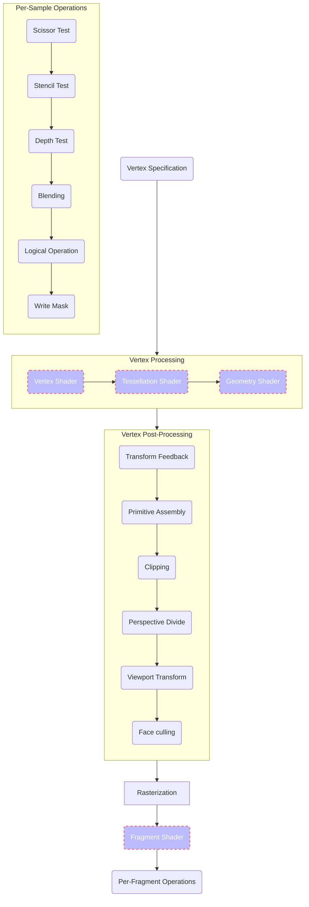

# OpenGL

OpenGL 渲染管线执行流程（标准版）：



上图中紫色虚框阶段是可编程阶段，其余阶段是固定功能阶段。

### Vertex Post-Processing

在顶点着色器处理之后，顶点还要经过一系列固定函数处理步骤，图元裁切、透视除法和视口变换就是这些固定函数处理步骤中的一环，位于顶点后处理([Vertex Post-Processing](https://www.khronos.org/opengl/wiki/Vertex_Post-Processing))阶段中。这里我们重点关注顶点后处理其中的图元裁切([Primitive Clipping](https://www.khronos.org/opengl/wiki/Vertex_Post-Processing#Clipping))、透视除法([the perspective divide](https://www.khronos.org/opengl/wiki/Vertex_Post-Processing#Perspective_divide))和到窗口空间的视口变换([the viewport transform](https://www.khronos.org/opengl/wiki/Vertex_Post-Processing#Viewport_transform) to window space)。首先顶点着色器有如下的预定义输出：

```glsl
out gl_PerVertex
{
  vec4 gl_Position;
  float gl_PointSize;
  float gl_ClipDistance[];
};
```

其中，gl_Position 是当前顶点的裁切空间输出位置。

#### Clipping

收集前几个阶段生成的图元，然后将其裁切到视锥体中。每个顶点都有一个裁切空间位置（即最后一个顶点处理阶段的 gl_Position 输出）。顶点的视锥体定义如下：

$$
-w_{clip} \leqslant x_{clip} \leqslant w_{clip}
$$

$$
-w_{clip} \leqslant y_{clip} \leqslant w_{clip}
$$

$$
-w_{clip} \leqslant z_{clip} \leqslant w_{clip}
$$

这可以通过 [Depth Clamping](https://www.khronos.org/opengl/wiki/Vertex_Post-Processing#Depth_clamping) 和添加用户定义的裁切平面来修改。

#### Perspective divide

从裁切阶段返回的裁切空间位置通过下面等式转换为归一化设备坐标（NDC）：

$$
\begin{pmatrix}
x_{ndc} \\
y_{ndc} \\
z_{ndc} \\
\end{pmatrix}
=
\begin{pmatrix}
\frac{x_{clip}}{w_{clip}} \\
\\
\frac{y_{clip}}{w_{clip}} \\
\\
\frac{z_{clip}}{w_{clip}} \\
\end{pmatrix}
$$

经过透视除法后归一化设备坐标分量 $x_{ndc}$、$y_{ndc}$ 和 $z_{ndc}$ 都位于 [-1.0, 1.0] 区间内。

#### Viewport transform

视口变换定义了顶点位置从 NDC 空间到窗口空间的变换。给定视口参数，我们可以通过下面的方程计算窗口空间坐标：

$$
\begin{pmatrix}
x_{wnd} \\
y_{wnd} \\
z_{wnd} \\
\end{pmatrix}
=
\begin{pmatrix}
\frac{width}{2}x_{ndc} + x + \frac{width}{2} \\
\\
\frac{height}{2}y_{ndc} + y + \frac{height}{2} \\
\\
\frac{farVal - nearVal}{2}z_{ndc} + \frac{farVal + nearVal}{2}
\end{pmatrix}
=
\begin{pmatrix}
x + \frac{x_{ndc} + 1}{2} width \\
\\
y + \frac{y_{ndc} + 1}{2} height \\
\\
\frac{farVal - nearVal}{2}z_{ndc} + \frac{farVal + nearVal}{2}
\end{pmatrix}
$$

在这里，$x$，$y$，$width$，$height$，$nearVal$，$farVal$ 是由下列视口定义函数的参数指定的：

```c
// set the viewport
// (x, y) Specify the lower left corner of the viewport rectangle, in pixels. The initial value is (0,0).
// (width, height) Specify the width and height of the viewport.
void glViewport(GLint x​, GLint y​, GLsizei width​, GLsizei height​);

// specify mapping of depth values from normalized device coordinates to window coordinates
// nearVal​ Specifies the mapping of the near clipping plane to window coordinates. The initial value is 0.
// farVal​ Specifies the mapping of the far clipping plane to window coordinates. The initial value is 1.
void glDepthRange(GLdouble nearVal​, GLdouble farVal​);

void glDepthRangef(GLfloat nearVal​, GLfloat farVal​);
```

我们知道 $x_{ndc}$ 和 $y_{ndc}$ 都位于 [-1.0, 1.0] 区间内。当 $x=0$, $y=0$ 时，可有如下推导：

$$ 
(x_{ndc} + 1), (y_{ndc} + 1) \in [0.0, 2.0]  
$$

继而：

$$
\frac{x_{ndc} + 1}{2}, \frac{y_{ndc} + 1}{2} \in [0.0, 1.0] \\
$$

进而：

$$
(\frac{x_{ndc} + 1}{2}) width \in [0.0,\ width], \ (\frac{y_{ndc} + 1}{2}) height \in [0.0,\ height​] \\
$$

即有 $x_{wnd} \in [0, width]$，$y_{wnd} \in [0, height]$。当 $x$ 和 $y$ 都有值时：

$$
x + (\frac{x_{ndc} + 1}{2}) width \ \in \ [x, x + width], \ y + (\frac{y_{ndc} + 1}{2}) height \ \in \ [y, y + height​] \\
$$

即有 $x_{wnd} \in [x, x + width]$，$y_{wnd} \in [y, y + height​]$。

我们还知道 $z_{ndc}$ 也位于 [-1.0, 1.0] 区间内，当 $z_{ndc} = -1.0$ 时：

$$
\begin{aligned}
z_{wnd} &= \frac{farVal - nearVal}{2}z_{ndc} + \frac{farVal + nearVal}{2}  \\
        &= \frac{-farVal + nearVal}{2} + \frac{farVal + nearVal}{2} \\
        &= \frac{-farVal}{2} + \frac{nearVal}{2} + \frac{farVal}{2} + \frac{nearVal}{2} \\
        &= nearVal
\end{aligned}
$$

当 $z_{ndc} = 1.0$ 时：

$$
\begin{aligned}
z_{wnd} &= \frac{farVal - nearVal}{2}z_{ndc} + \frac{farVal + nearVal}{2}  \\
        &= \frac{farVal - nearVal}{2} + \frac{farVal + nearVal}{2} \\
        &= \frac{farVal}{2} - \frac{nearVal}{2} + \frac{farVal}{2} + \frac{nearVal}{2} \\
        &= farVal
\end{aligned}
$$

可知 $z_{wnd}$ 位于 [nearVal, farVal] 区间内。

### Fragment Shader

片段着色器是为光栅化产生的片段生成一组颜色和一个深度值的着色器阶段。

#### Inputs

片段着色器有下面这些内置输入变量：

```glsl
in vec4 gl_FragCoord;
in bool gl_FrontFacing;
in vec2 gl_PointCoord;
```

其中，gl_FragCoord 是窗口空间中片段的位置。X、Y 和 Z 分量是片段的窗口空间位置。如果此着色器阶段未将 gl_FragDepth 写入深度缓冲区，则 Z 值将被写入深度缓冲区。W 分量是 $1/\mathsf{W_{clip}}$，这里 $\mathsf{W_{clip}}$ 是最后一个顶点处理阶段输出到 gl_Position 中的裁切空间顶点位置的 W 分量的插值。

gl_FragCoord 的空间可以通过使用特殊的输入布局限定符重新声明 gl_FragCoord 来修改：

```glsl
layout(origin_upper_left) in vec4 gl_FragCoord;
```
这意味着 gl_FragCoord 窗口空间的原点将是屏幕的左上角，而不是通常的左下角。OpenGL 窗口空间中将像素中心定义在半整数边界上。因此左下角像素的中心点为 (0.5, 0.5)。

### Others

另外，这里引用 LearnOpenGL 中的一幅 OpenGL 渲染管线执行流程（简化版）图帮助加深理解：


## Vulkan

Vulkan 图形管线执行流程：


## Conclusion

可以看到，图元装配是按照指定的拓扑将一个类似于 glDrawElements 这样的绘制指令涉及的一系列顶点组装成为目标形状的操作，OpenGL 的输入装配是在顶点着色器和片段着色器之间，而 Vulkan 的输入装配是在顶点着色器之前；OpenGL 的模版与深度测试默认是在【测试与混合】阶段执行，在后期 OpenGL 还加入了 Early Fragment Test 特性，允许模版与深度等测试在片段着色器之前执行。Vulkan 在片段着色器前后有一个 Early Per-Fragment Test 和 Late Per-Fragment Test, 可以指定模版与深度测试在哪个阶段执行，默认是在 Late Per-Fragment Test 阶段执行。


## References
>
> * [OpenGL Rendering Pipeline Overview](https://www.khronos.org/opengl/wiki/Rendering_Pipeline_Overview)
>
> * [Vulkan Rendering Pipeline Overview](https://docs.vulkan.org/spec/latest/chapters/pipelines.html)
>
> * [OpenGL Vertex Shader](https://www.khronos.org/opengl/wiki/Vertex_Shader)
>
> * [OpenGL Fragment Shader](https://www.khronos.org/opengl/wiki/Fragment_Shader)
>
> * [OpenGL® 4.5 Reference Pages](https://registry.khronos.org/OpenGL-Refpages/gl4/)
