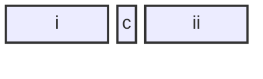
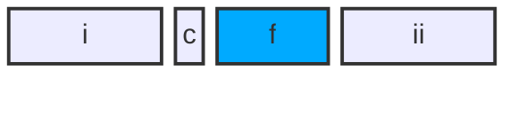
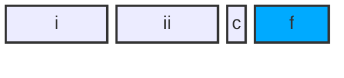

许多计算机系统对基本数据类型的合法地址做了一些限制，要求某种类型对象的地址必须是某个值 K 的倍数（通常是 2、4 或 8的倍数）。这种对齐限制简化了形成处理器和内存系统之间接口的硬件设计。例如，假设一个处理器总是从内存中取 8 个字节，则地址必须为 8 的倍数。如果我们能保证将所有的 double 类型数据的地址对齐成 8 的倍数，那么就可以用一个内存操作来读或者写值了。否则，我们可能需要执行两次内存访问，因为对象可能被分放在两个 8 字节内存块中。

无论数据是否对齐，x86-64 硬件都能正确工作。不过，还是建议要对齐数据以提高内存系统的性能。对齐原则是任何 K 字节的基本对象的地址必须是 K 的倍数。可以看到这条原则会得到如下对齐：

| K           | 类型                  |        
| :---------- | :-------------------- | 
| 1           | char                  | 
| 2           | short                 | 
| 4           | int, float            | 
| 8           | long, double, char*   |

确保每种数据类型都是按照指定方式来组织和分配，即每种类型的对象都满足它的对齐限制，就可保证实施对齐。

对于包含结构体的代码，编译器可能需要在字段的分配中植入间隙，以保证每个结构元素都满足它的对齐要求。而结构体本身对它的起始地址也有一些对齐要求。

比如说，考虑下面的结构声明：

```c++
struct S1 {
    int i;
    char c;
    int ii;
};
```

假设编译器用最小的 9 字节分配，画出图来是这样的：



它是不可能满足字段 i（偏移为 0）和 ii（偏移为 5）的 4 字节对齐要求的。取而代之地，编译器会在字段 c 和 j 之间插入一个 3 字节的间隙（在此用蓝色阴影表示）：



结果，ii 的偏移量为 8，而整个结构体的大小为 12 字节。此外，编译器必须保证任何 struct S1* 类型的指针 p 都满足 4 字节对齐。设指针 p 的值为 ptrVal，那么， ptrVal 必须是 4 的倍数。这就保证了 p->i（地址 ptrVal）和 p->ii（地址 ptrVal + 8）都满足它们的 4 字节对齐要求。

另外，结构体的末尾可能也需要一些填充，这样**结构体数组**中的每个元素都会满足它的对齐要求。例如，考虑下面的这个结构声明：

```c++
struct S2 {
    int i;
    int ii;
    char c;
};
```

如果我们将这个结构打包成 9 个字节，只要使得结构的起始地址满足 4 字节对齐要求，那么我们仍然能够保证字段 i 和 ii 的对齐满足要求。不过，考虑下面的结构体数组声明：

```c++
struct S2 S2Array[4];
```

如果每个结构体分配成 9 个字节，是不可能满足 S2Array 中每个元素的对齐要求的，因为这样的话这些元素的地址分别是 arrayPtrVal、arrayPtrVal + 9、arrayPtrVal + 18、arrayPtrVal + 27。实际上，编译器会为结构体 S2 分配 12 个字节，最后 3 个字节是浪费的空间：



这样一来，S2Array 的元素地址分别为 arrayPtrVal、arrayPtrVal + 12、arrayPtrVal + 24、arrayPtrVal + 36。只要 arrayPtrVal 是 4 的倍数，所有的对齐限制就都可以满足了。