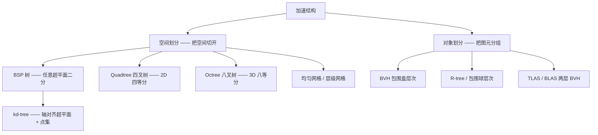
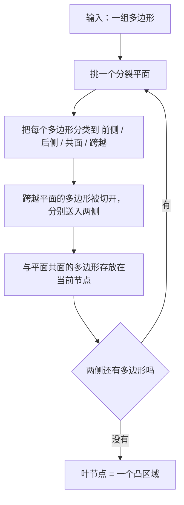
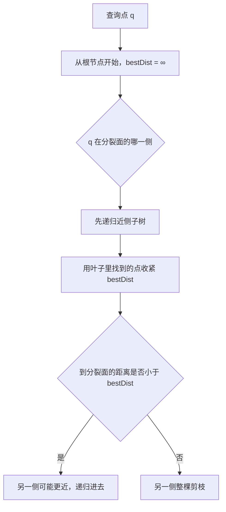
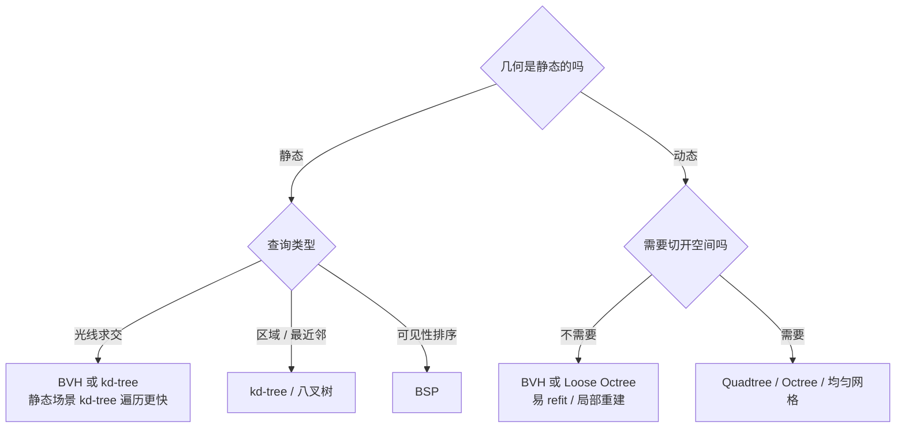

## 为什么需要空间划分

渲染器里几乎所有的重活，最后都会归结成同一类问题：

* **这条光线会击中哪个三角形？**（光线追踪、阴影、环境光遮蔽、路径追踪）
* **视锥里有哪些物体需要提交给 GPU？**（视锥剔除、遮挡剔除）
* **这两个物体会不会撞在一起？**（物理 broadphase）
* **离我最近的 N 个光子 / 粒子是哪些？**（光子映射、SPH 流体、高斯泼溅）

这些问题的暴力解法都是 $O(n)$ 的线性扫描：每次查询都遍历全部数据。当图元数以十万、百万计时，而每帧要发射上千万条光线，线性扫描完全不可行。空间划分（Spatial Partition）就是用**一次预处理**换取查询加速的技术：付出一次构建代价，把之后每一次查询的复杂度从 $O(n)$ 降到 $O(\log n)$ 量级。

下面三个数字都可以在本文的交互演示里亲手复现（纯 Canvas 手写，不依赖任何外部库）：

| 场景 | 暴力解法 | 使用加速结构 |
| --- | --- | --- |
| 1200 个点的区域查询 | 1200 次距离计算 | 八叉树：83 次 |
| 320 条线段的光线求交 | 320 次图元求交 | BVH：4 次（约 80×） |
| 184 个点的邻近对查找 | 16836 次两两测试 | 四叉树：923 次（约 18×） |

## 两大流派：空间划分 与 对象划分




_空间划分把空间切成互不重叠的单元，图元可能跨越单元；对象划分则把图元分组，包围盒允许互相重叠_

这两派的核心差别，决定了它们各自擅长的场合：

* **空间划分**：区域互不重叠，因此"某个位置上有什么"这类查询可以直接沿树下降，区域查询和邻域查询天然高效；代价是图元可能被切开或在多个单元里重复引用，且空区域会浪费内存。
* **对象划分**：图元保持完整，每个图元只属于一个叶子节点，动态更新时只需要重算包围盒（refit）；代价是包围盒会重叠，遍历时可能重复访问同一批图元。

## 通用术语与代价模型

在比较具体结构之前，先统一几个后面会反复用到的说法：

| 术语 | 含义 |
| --- | --- |
| 节点 / 单元（node / cell） | 树上的一个区域，通常带一个包围盒 |
| 叶节点（leaf） | 不再细分的节点，里面存放图元或数据点 |
| 桶容量（capacity / leaf size） | 叶节点最多容纳多少元素，超出就继续细分 |
| 构建（build） | 结构化预处理，$O(n \log n)$ 是常见目标 |
| 查询（query / traversal） | 点/区域/最近邻/射线求交，平均 $O(\log n)$ |
| 更新（update / refit） | 动态场景里重算包围盒或局部重建子树 |
| SAH | 表面积启发式，用一个代价函数挑选最优分割 |

一个结构好不好，通常看这几项：**构建时间、查询时间、内存占用、动态更新能力、对 GPU 的友好程度**。下面的表格是全文的"地图":

| 结构 | 划分方式 | 构建 | 查询 | 动态更新 | 典型应用 |
| --- | --- | --- | --- | --- | --- |
| BSP | 任意超平面 | $O(n\log n)$，需切割多边形 | $O(\log n)$ | 几乎不可更新 | 画家算法排序、CSG、静态碰撞 |
| kd-tree | 轴对齐超平面 | $O(n\log n)$ | 平均 $O(\log n)$ | 困难 | 光子映射、最近邻、静态场景光追 |
| Quadtree | 2D 固定四等分 | $O(n\log n)$ | 平均 $O(\log n)$ | 容易（局部重建） | 2D broadphase、地形 LOD、瓦片 |
| Octree | 3D 固定八等分 | $O(n\log n)$ | 平均 $O(\log n)$ | 容易 | 视锥剔除、体积渲染、SVO |
| BVH | 图元分组 | $O(n\log n)$，常数更大 | 平均 $O(\log n)$ | 容易（refit） | 实时光追、GPU 剔除、物理 |

## BSP 

在计算机科学中，二叉空间分割（英语：Binary space partitioning，简称BSP）是一种通过使用超平面作为分割，将欧几里得空间递归细分为两个凸集的算法。这个过程将空间细分转化为了树结构，即所谓的二叉空间分割树（BSP 树）。


_The process of making a BSP tree_

BSP 是这一族结构里最"自由"的一个：分裂平面可以是任意方向、任意位置（只要不与已有平面退化）。构建过程大致如下：



```cpp
struct BSPNode {
    Plane    plane;                // n · p + d = 0
    std::vector<Polygon> coplanar;  // 与平面共面，属于当前节点
    BSPNode* front = nullptr;       // n · p + d > 0 的一侧
    BSPNode* back  = nullptr;       // n · p + d < 0 的一侧
};

BSPNode* Build(const std::vector<Polygon>& polys) {
    if (polys.empty()) return nullptr;
    BSPNode* node = new BSPNode;
    node->plane = ChooseSplitPlane(polys);     // 常见做法：取某个多边形的支撑平面

    std::vector<Polygon> front, back;
    for (const Polygon& p : polys) {
        switch (Classify(node->plane, p)) {
            case COPLANAR: node->coplanar.push_back(p);  break;
            case FRONT:    front.push_back(p);           break;
            case BACK:     back.push_back(p);            break;
            case SPANNING: {                                 // 跨越平面：必须切开
                auto [f, b] = Split(node->plane, p);
                front.push_back(f);
                back.push_back(b);
                break;
            }
        }
    }
    node->front = Build(front);
    node->back  = Build(back);
    return node;
}
```

### 画家算法：BSP 最经典的用途

在 Z-Buffer 普及之前，要在没有深度缓冲的硬件上正确绘制可见面，就需要把多边形按"从远到近"的顺序提交（painter's algorithm）。BSP 树天然提供了这个顺序：根据视点落在分裂平面的哪一侧，先画远的一侧、再画共面的多边形、最后画近的一侧。整棵树的遍历顺序与三角形位置无关，只需 $O(n)$ 时间：

```cpp
void TraverseBackToFront(const BSPNode* node, const Vec3& eye) {
    if (!node) return;
    const float d = dot(node->plane.n, eye) + node->plane.d;

    const BSPNode* nearSide = (d > 0.f) ? node->front : node->back;
    const BSPNode* farSide  = (d > 0.f) ? node->back  : node->front;

    TraverseBackToFront(farSide, eye);      // 先画远的
    Draw(node->coplanar);
    TraverseBackToFront(nearSide, eye);     // 后画近的，覆盖掉被遮挡的部分
}
```

### 交互演示：任意方向的分割 + 画家算法

下面的演示分两种模式，它们分别对应 BSP 的两个特点 —— **分裂平面可以任意倾斜**（这是它和 kd-tree 最本质的区别），以及**遍历顺序只取决于视点**：

1. **递归分割**：单击画布可以自己加线段。分裂平面永远是"某条线段的支撑直线"，所以切出来的区域一定是凸的（右侧的树里，叶子就是这些凸区域）。注意左下角的统计——**"碎片后线段"会明显大于"原始线段"**，这就是 BSP 最著名的代价：切割产生碎片。换一换"分裂平面"策略（最佳平衡 / 取最长 / 随机），碎片数量差别很大。
2. **画家算法排序**：拖动红色视点，观察每个凸区域上的绘制编号如何变化——**树没有变，变的只是遍历时先走哪一侧**；编号 1 是最远的区域，最后画的是离视点最近的区域。

<iframe src="/assets/html/spatial-partition/bsp.html" title="BSP 交互演示" loading="lazy" frameborder="0" style="display:block;width:100%;height:620px;border:1px solid #d8e0ec;border-radius:10px"></iframe>

<p style="text-align:center;font-size:.85em;opacity:.7;margin-top:.4rem">BSP 交互演示：递归分割（任意方向超平面、碎片统计、BSP 树）与画家算法排序两种模式。若嵌入页面未显示，可<a href="/assets/html/spatial-partition/bsp.html" target="_blank" rel="noopener">在新标签页打开</a>。</p>

Doom 与 Quake 系列正是靠 BSP 做场景排序和碰撞检测（Quake 的关卡文件格式至今仍叫 `.bsp`），它的另一个重要用途是 **CSG（构造实体几何）**：并集、交集、差集都可以直接在 BSP 树上完成——把两棵树合并后，按需求遍历时保留/丢弃哪些叶区域即可，这也是很多建模工具做布尔运算的实现方式。

### 代价与结论

* **切割产生碎片**：跨越平面的多边形会被切开，三角形数量可能显著增加，甚至出现又细又长的退化三角形。
* **构建昂贵且不友好于并行**：构建是深度递归 + 数据依赖的，很难摊到 GPU 上。
* **动态更新困难**：一个物体移动，可能影响树上很长一条路径。

因此现代实时渲染很少再用 BSP 做光追求交，但**它的思想渗透得到处都是**：轴对齐的 BSP 就是 kd-tree，BSP 的"凸区域划分"也是后面所有空间划分结构的共同祖先。

## kd-tree

k-d 树（全称为 k-dimensional tree）是一种可以高效处理 k 维空间信息的数据结构。它是一棵二叉树，是 BSP 树的一种特殊情况，其中每个节点都是一个 k 维点。每个非叶节点都可以被认为是隐式生成分割的超平面，该超平面将空间分成两部分，称为半空间。此超平面左侧的点由该节点的左子树表示，超平面右侧的点由右子树表示。超平面方向的选择方式如下：树中的每个节点都与 k 维中的一个维度相关联，超平面垂直于该维度的轴。例如，如果对于特定的分割，选择了 “x” 轴，则子树中 “x” 值小于节点的所有点都将出现在左侧子树中，而 “x” 值较大的所有点将出现在右侧子树中。在这种情况下，超平面将由点的 x 值设置，其法线将是单位 x 轴。

规范的 k-d 树构造方法有如下约束条件：

* 当沿着树向下移动时，将采用一种循环的方式在 k 维轴间选择创建分割平面的轴。（例如，在 3 维树中，根将具有 x 对齐平面，根的子项都将具有 y 对齐平面，根的孙子项都将具有 z 对齐平面，根的曾孙项都将具有 x 对齐平面，根的曾曾孙项都将具有 y 对齐平面，以此类推。

* 在要放入子树的点间选择中位数点来插入，这个中位数点是依据要放入的那些点在创建分割平面的轴中的坐标而确定的。使用中位数点会生成一个平衡的 k-d 树。

为了方便理解，我们举一个 k=2 时的例子：

{:width="400" height="400"}

其构建出 k-D Tree 的形态可能是这样的：

{:width="570" height="416"}

其中树上每个结点上的坐标是选择的分割点的坐标，非叶子结点旁的 x 或 y 是选择的切割维度。

### 每次分裂的两个自由度

上面的"规范"做法（轮转轴 + 中位数）保证了平衡，但并不是唯一选择。每一次分裂其实有两个自由度，它们的组合决定了树的形状与查询性能：

| 决策 | 常见策略 | 说明 |
| --- | --- | --- |
| 选哪根轴 | 轮转、最长边、最大方差、**SAH** | 数据在一个方向上拉得很长时，轮转会浪费很多空区域 |
| 在哪分裂 | 中位数、中点、**SAH 最优位置** | 中位数保证平衡；SAH 则偏向"面积小的子节点装更多点" |
| 何时停止 | 桶容量、最大深度 | 叶子里线性扫描的常数很小，容忍几个到十几个点是划算的 |

### 查询：范围查询与最近邻

**最近邻查询**是 kd-tree 最漂亮的剪枝应用。用一个变量 `bestDist` 记录当前最优解，任何"离查询点最近距离都不可能小于 `bestDist`"的子树都可以整棵剪掉。对 kd-tree 来说这个不等式非常便宜：只比较查询点到分裂平面的距离即可。

```cpp
void QueryNN(const Node* n, const Vec3& q, float& bestDist, int& bestIdx) {
    // 连包围盒都离得太远，整棵子树直接剪掉
    if (!n || Dist2ToBox(n->box, q) >= bestDist * bestDist) return;

    if (!n->pts.empty()) {                   // 叶子：线性扫描桶内的所有点
        for (int i : n->pts) {
            const float d2 = Length2(g_pts[i] - q);
            if (d2 < bestDist * bestDist) {
                bestDist = std::sqrt(d2);
                bestIdx  = i;
            }
        }
        return;
    }

    // 先访问 q 所在的一侧，让 bestDist 尽快收紧（这一点对性能影响极大）
    const bool goLeft = q[n->axis] < n->split;
    QueryNN(goLeft ? n->left : n->right, q, bestDist, bestIdx);

    // 只有查询点到分裂面的距离小于当前最近距离时，另一侧才可能更近
    if (std::abs(q[n->axis] - n->split) < bestDist)
        QueryNN(goLeft ? n->right : n->left, q, bestDist, bestIdx);
}
```



### 交互演示：自己动手感受剪枝

下面的演示里，移动鼠标即可放置查询点，右下角的统计会实时对比"kd-tree 访问了多少个节点/点了多少次距离"与"暴力枚举"的差距；点击画布可以播放一次完整的遍历过程（蓝色 = 被访问的节点，红色虚线 = 被剪枝的节点，绿色 = 参与了距离计算的点）。

<iframe src="/assets/html/spatial-partition/kdtree.html" title="kd-tree 交互演示" loading="lazy" frameborder="0" style="display:block;width:100%;height:540px;border:1px solid #d8e0ec;border-radius:10px"></iframe>

<p style="text-align:center;font-size:.85em;opacity:.7;margin-top:.4rem">kd-tree 交互演示：移动鼠标放置查询点，点击画布播放一次遍历。若嵌入页面未显示，可<a href="/assets/html/spatial-partition/kdtree.html" target="_blank" rel="noopener">在新标签页打开</a>。</p>

### kd-tree 在图形学里到底用在哪

* **光子映射（photon mapping）**：几十万到上百万个光子的最近邻查询，kd-tree 是经典选择（因为点集构建一次就不再变化）。
* **点云 / 粒子的邻域查询**：SPH、点云配准、几何处理。
* **静态场景的光线求交**：Ingo Wald 等人的工作表明，在 CPU 上精心构建的 kd-tree，其**遍历速度通常比 BVH 更快（约 2~3 倍）**，原因是 kd-tree 的单元是空间本身、不存在重叠，遍历时的求交测试次数更少。
* **代价**：kd-tree 的构建慢得多（对大量重叠三角形尤其糟糕），并且几乎没有好的增量更新手段；再加上 GPU 上大规模并行构建和遍历的需求，**这直接导致了现代实时光追最终选择了 BVH**。

## Quadtree

四叉树（Quadtree）把 BSP 的"自由分割"换成了"固定单位等分"：每一层把正方形区域切成 4 个象限。它有两类常见形态：

* **区域四叉树（region quadtree）**：区域永远是正方形的一半，图元被分配到包含它的象限里——用于空间分区、剔除、图像压缩。
* **点四叉树（point quadtree）**：按点本身的位置选分裂位置，用于点的索引。

工程上最常用的是区域四叉树，它的三个参数决定了全部行为：**桶容量、最大深度、以及溢出时的处理策略**。


_四叉树的自适应细分（循环动画）：桶内元素超过容量就四分，并且只在元素密集的地方继续加深_

```cpp
void Insert(Node* n, const Point& p) {
    if (n->isLeaf) {
        n->points.push_back(p);
        // 桶溢出：四分，并把原有元素下推到 4 个子节点
        if (n->points.size() > kCapacity && n->depth < kMaxDepth)
            SubdivideAndRedistribute(n);
        return;
    }
    Insert(ChildContaining(n, p), p);   // 只需要一次象限判断
}
```

### 交互演示：从插入、查询到 broadphase

下面的演示有三种模式，建议依次切换看看：

1. **插入 / 分裂**：单击画布插入一个点（或点"自动插入"），观察高亮的插入路径，以及桶溢出瞬间的四分。
2. **范围查询**：移动鼠标改变查询圆的位置，对比"访问节点数 / 命中点数"与"暴力枚举全部点"的差别。
3. **邻近对 broadphase**：拖大半径，观察"候选测试次数"相对暴力两两测试（$n(n-1)/2$）骤降——这就是物理引擎宽阶段加速的本质。

<iframe src="/assets/html/spatial-partition/quadtree.html" title="Quadtree 交互演示" loading="lazy" frameborder="0" style="display:block;width:100%;height:540px;border:1px solid #d8e0ec;border-radius:10px"></iframe>

<p style="text-align:center;font-size:.85em;opacity:.7;margin-top:.4rem">Quadtree 交互演示：插入 / 范围查询 / 邻近对检测三种模式。若嵌入页面未显示，可<a href="/assets/html/spatial-partition/quadtree.html" target="_blank" rel="noopener">在新标签页打开</a>。</p>

### 几个必须知道的工程细节

**1. Loose Quadtree（宽松四叉树）**

普通四叉树有个致命问题：一个物体刚好压在分割线上，就会在两个（甚至四个）子节点里各存一份；动态物体来回穿越分割线时，还要在兄弟节点之间反复搬运。**做法是把每个节点的区域向外放宽一个系数（常见 2 倍）**，于是任何比阈值小的物体都必然能完整装进某一个节点里，物体只属于一个节点，插入删除都变成 $O(1)$ 级别。这是**宽松八叉树 / Loose Octree** 在动态场景剔除里非常流行的原因。

**2. Morton 编码与线性四叉树（Z-order curve）**

把象限编号按位交错编码成 Morton code（2D 交错 x/y 的每一位，3D 交错 x/y/z），排序后就能得到一条 Z 字形空间填充曲线。它带来两个重要好处：

* 空间相邻的点在内存里也相邻 → 缓存命中率与 SIMD 效率大幅提升；
* 可以只存"叶子"的 Morton code（线性四叉树 / linear quadtree），不存指针，直接二分查找定位；


**3. 只在需要时细分的停止策略**

| 策略 | 行为 | 适用 |
| --- | --- | --- |
| 固定最大深度 | 到达深度就不再分 | 简单可预测，实时系统首选 |
| 桶容量 | 元素数超过容量才分 | 数据分布不均时更优 |
| 面积/误差准则 | 细分带来的收益小于阈值就停 | 地形 LOD、图像压缩 |

### 典型应用

* **2D 碰撞检测 broadphase**：粒子、子弹、2D 物理。演示里的 184 个点，候选测试从 16836 次降到 923 次。
* **地形 LOD**：quadtree LOD、CDLOD（Chunked LOD）按摄像机距离决定细分层级，是开放世界地形的标准做法；纹理侧的对应物是 Clipmap 与 mipmap 金字塔。
* **影像与瓦片管理**：GIS 地图瓦片（z/x/y 本质上就是四叉树的坐标）、流式加载的可见性判断。
* **图像压缩与稀疏表示**：区域四叉树可以直接表达"某块区域颜色相同"。

## Octree

八叉树就是把区域四叉树延伸到三维：每个节点把立方体切成 8 个子节点。它在渲染中最常见的目标是**快速丢弃大量无关的物体或空区域**。


_八等分与自适应细分（循环动画）：元素少的子节点直接成为叶子，空节点完全不存储，这正是稀疏体素的结构基础_

```cpp
void Subdivide(Node* n) {
    const Vec3 c = n->box.center();
    for (int i = 0; i < 8; ++i) {                 // 三位分别代表 x/y/z 的正负
        const Vec3 sign((i & 1) ? +1.f : -1.f,
                        (i & 2) ? +1.f : -1.f,
                        (i & 4) ? +1.f : -1.f);
        n->child[i] = newNode(Box{c, n->box.half * sign});
    }
    // 把点按象限下推；空子节点直接为 nullptr，不分配内存
    for (const Point& p : n->points) {
        Node* c = n->child[OctantIndex(n->box, p)];
        if (c) c->points.push_back(p);
    }
    n->points.clear();
    n->isLeaf = false;
}
```

### 交互演示：三维里感受一下

下面是一个可以旋转缩放的三维八叉树，鼠标拖拽旋转、滚轮缩放。建议试试：

* 把"点云"切换成**球壳**或**团簇**，观察八叉树如何只在表面/团簇附近细分（这就是 SVO 的空间自适应性）；
* 拖"显示到第 N 层"滑块或点"逐层展开"，看层级是如何建立起来的；
* 点"随机查询盒"，观察虚线查询盒与"相交节点 / 总节点"、"测试点数 / 暴力"的比例。

<iframe src="/assets/html/spatial-partition/octree.html" title="Octree 交互演示" loading="lazy" frameborder="0" style="display:block;width:100%;height:560px;border:1px solid #d8e0ec;border-radius:10px"></iframe>

<p style="text-align:center;font-size:.85em;opacity:.7;margin-top:.4rem">Octree 交互演示：拖拽旋转、滚轮缩放，切换点云分布观察自适应细分。若嵌入页面未显示，可<a href="/assets/html/spatial-partition/octree.html" target="_blank" rel="noopener">在新标签页打开</a>。</p>

### 变体

* **Loose Octree（宽松八叉树）**：与宽松四叉树同样的思路，把节点区域放大，保证物体只归属一个节点。UE、Unity 等引擎的动态场景剔除普遍采用这一策略。
* **Sparse Voxel Octree（SVO）**：只存有内容的节点，用指针或线性化数组表示；配合锥形追踪（cone tracing）可以做实时的间接光近似。
* **VDB / Brickmap**：把八叉树（或层级）与固定尺寸的 dense brick 结合，OpenVDB / NanoVDB 是影视与扩散模型里的主流稀疏体数据结构。
* **线性八叉树**：只存叶子的 Morton code 数组，遍历时用位运算找邻居（GPU 上非常常见的实现方式）。

### 查询与遍历

| 查询类型 | 做法 | 典型用途 |
| --- | --- | --- |
| 视锥剔除 | 节点 AABB 与 6 个视锥平面求交，整个在外侧就丢弃 | 场景与阴影剔除 |
| 区域 / 球查询 | 递归下降，与查询体不相交就剪枝 | 邻域搜索、broadphase |
| 射线遍历 | 层级 DDA 或节点 AABB 的 slab 测试，跳过空节点 | 体积渲染的空空间跳跃 |
| 最近邻 | 按"距离下界"优先的优先队列遍历 | 点云与体素的最近邻 |

一个直观的经验值：**对于三维体数据，八叉树的"命中率"通常远高于四叉树，因为三维空间的体积增长比表面积快，剪枝掉一部分区域的收益更大。**

## BVH

BVH（Bounding Volume Hierarchy，包围盒层次）走的是另一条路：**不去划分空间，而是把图元分组，每组外面套一个包围盒**。包围盒之间允许重叠，但每个图元只属于一个叶节点。


_BVH 的自顶向下划分（循环动画）：先用一个包围盒包住全部图元，再按 SAH 一分为二，递归到叶节点只剩少量图元_

### 怎么分？表面积启发式 SAH

BVH 构建的质量几乎完全取决于"怎么切"。业界标准答案是 **SAH（Surface Area Heuristic）**：把一次查询的期望代价写成

$$
C = C_{trav} + \frac{S_L}{S}\,N_L\,C_{isect} + \frac{S_R}{S}\,N_R\,C_{isect}
$$

其中 $C_{trav}$ 是访问一个节点的代价，$S$ 是父节点包围盒的表面积，$S_L, S_R$ 是两个子节点包围盒的表面积，$N_L, N_R$ 是各自包含的图元数，$C_{isect}$ 是单次图元求交的代价。它的直觉是：**一个子节点被访问的概率正比于它的表面积**（对随机方向的射线成立），所以我们希望"面积大的孩子少装点东西，面积小的孩子可以多装点"。

实际实现里常用 **binned SAH**：把质心范围切成 12~32 个桶，对每个轴做一遍前缀/后缀扫描，用 $O(n)$ 的时间近似求出最优分裂，而不是精确枚举 $n-1$ 个候选位置。

```cpp
struct Node { AABB box; Node *left, *right; std::vector<int> prims; };

Node* Build(std::vector<int> idx, int depth) {
    AABB box = UnionBounds(idx);
    Node* n = new Node{ box };
    if (idx.size() <= kLeafSize || depth >= kMaxDepth) {
        n->prims = idx;                  // 叶节点：只放少量图元，之后线性扫描
        return n;
    }

    // binned SAH：三轴各切 12 个桶，取代价最小的轴与切分位置，代价见上面的公式
    Split best = FindBestSplitBinned(idx, box, /*bins=*/12);

    // 兜底：SAH 找不到有效切分（质心重合等）时，按中位数强制一分为二
    if (!best.valid) return SplitByMedian(idx, box, n, depth);

    auto [L, R] = Partition(idx, best);
    n->left  = Build(L, depth + 1);      // 子节点的包围盒由其内部图元重新计算
    n->right = Build(R, depth + 1);
    return n;
}
```

常见的构建变体：

| 方法 | 思路 | 特点 |
| --- | --- | --- |
| 中位数 / 中切 | 按质心排序取中位 | 极快，质量一般 |
| **binned SAH** | 分桶近似 SAH，自顶向下 | 质量与速度的平衡点，PBRT/Embree 等的默认 |
| LBVH | Morton 编码 + 基数排序，纯并行构建 | 极快（GPU 首选），质量略差，常配合后续优化 |
| HLBVH | 上层 SAH、下层 LBVH 混合 | 兼顾质量与并行度 |
| 自底向上聚类 | 反复合并最"划算"的节点 | 质量高，实现复杂 |
| 增量插入 | 把新图元插入到代价最小的位置 | 适合逐个动态加入的场景 |

### 遍历：slab 测试 + 有序遍历 + 提前退出

```cpp
// 返回 [tMin, tMax] 内与射线相交的最近距离，hit 保存结果
float Traverse(Node* n, const Ray& r, Hit& hit) {
    if (!Slab(n->box, r, hit.t)) return kInf;      // AABB 不命中 → 整棵剪枝

    if (!n->prims.empty()) {                       // 叶子：真正昂贵的图元求交
        for (int i : n->prims) g_prims[i].Intersect(r, hit);
        return hit.t;
    }

    // 有序遍历：先进入入口距离更小的那个子节点
    Node *c0 = n->left, *c1 = n->right;
    float t0 = Slab(c0->box, r), t1 = Slab(c1->box, r);
    if (t1 < t0) { std::swap(c0, c1); std::swap(t0, t1); }

    Traverse(c0, r, hit);
    if (t1 < hit.t) Traverse(c1, r, hit);          // 否则远侧已被近侧挡住
    return hit.t;
}
```

几个能显著影响性能的细节：

* **有序遍历（front-to-back）**：先访问近的子节点，能更快收紧 `hit.t`，让远侧子树在 slab 测试阶段就被拒绝。对主光线、阴影射线、AO 射线都有巨大收益。
* **任意命中提前退出**：阴影射线只关心"有没有遮挡"，一旦命中就可以立刻返回——这是 shadow ray 比主光线快得多的原因。
* **鲁棒的 slab 测试**：直接算 $1/d$ 会在射线方向分量为 0 或极小时产生 NaN/Inf，需要用 Ize 提出的鲁棒版本（正确处理 `-0.0` 与无穷）避免漏命中。
* **宽 BVH（BVH4 / BVH8 / QBVH）**：一个节点放 4 或 8 个孩子，一次 SIMD 指令完成多个 AABB 测试，遍历时栈更深但每层分支更少，在 CPU 与 GPU 上都很流行。
* **SBVH（Spatial Splits BVH）**：当大量三角形互相重叠（比如草叶、毛发）时，允许把三角形在空间上也切开（类似 BSP），显著提升这类场景的遍历性能。
* **两层结构 TLAS / BLAS**：把每个物体各自建一棵 BLAS（可复用、可动态更新），再用顶层 TLAS 把实例组织起来。这是 DXR / Vulkan Ray Tracing 的直接映射。

### 为什么 GPU 光追最终选了 BVH

| 需求 | BVH 的回答 |
| --- | --- |
| 三角形几百万、场景动态 | 每个图元只属于一个叶节点，移动后只需重算包围盒（refit），或对局部子树重建 |
| 构建要快 | LBVH：Morton 编码 + 基数排序，完全并行，$O(n)$ 级构建 |
| 遍历要适合硬件 | 节点小、层次浅、AABB 规整，适合固定功能单元流水线化 |
| 内存要省 | 每个内部节点只存两个子节点包围盒，可压缩到 32 字节以内（BVH2） |

相比之下，kd-tree 的构建慢、更新难，SVO 的遍历对光线方向不友好——这也解释了为什么 RTX 硬件与 OptiX/Embree 都以 BVH（配合 SBVH / 宽 BVH）为核心。

### 交互演示：射线遍历全过程

下面的演示构建了一棵真实的 SAH-BVH（320 条线段），你可以：

* 移动鼠标设置射线起点、拖动"射线角度"改变方向：白色射线会只穿过少量包围盒；
* 切换"最近命中 / 任意命中（阴影射线）"，对比遍历的差异——阴影射线命中即停，测试次数明显更少；
* 切换"SAH / 中位数"与调整"叶容量"，观察包围盒形状与"图元求交 / 暴力"的比值变化；
* 点"播放遍历"逐帧观察递归下降的顺序，打开"遍历序号"可以看到访问次序编号。

<iframe src="/assets/html/spatial-partition/bvh.html" title="BVH 交互演示" loading="lazy" frameborder="0" style="display:block;width:100%;height:540px;border:1px solid #d8e0ec;border-radius:10px"></iframe>

<p style="text-align:center;font-size:.85em;opacity:.7;margin-top:.4rem">BVH 交互演示：移动鼠标设置射线起点，对比 SAH / 中位数与最近命中 / 任意命中。若嵌入页面未显示，可<a href="/assets/html/spatial-partition/bvh.html" target="_blank" rel="noopener">在新标签页打开</a>。</p>

## 怎么选：一份速查表



* **动态场景 + 光线求交** → BVH（配 LBVH 构建或 refit）。
* **静态场景 + 光线求交（CPU）** → kd-tree 仍然可能是最快的遍历结构。
* **点集的最近邻 / 范围查询** → kd-tree 或八叉树，数据量大时优先线性化 + Morton 排序。
* **2D 碰撞 / 邻居查找** → 均匀网格（分布均匀时）或四叉树（分布不均时）。
* **动态场景剔除** → Loose Octree（保证一个物体只属于一个节点）。
* **稀疏体数据 / 体积渲染** → 八叉树 + 空空间跳跃，或 VDB/NanoVDB。
* **大规模并行的现代 GPU 管线** → 两层 BVH（TLAS/BLAS）+ 宽节点 + Morton 排序的构建。

如果预算允许，**混合方案往往是最好的**：比如"八叉树做粗粒度空间剔除 + 每个单元内一棵 BVH"、"Loose Octree 剔除 + 两级 BVH 光追"、"均匀网格 + SAH-BVH"，都是实际引擎里常见的组合。

## References
>
> * [Binary space partitioning --- wikipedia](https://en.wikipedia.org/wiki/Binary_space_partitioning)
>
> * [K-D Tree --- OI Wiki](https://oi-wiki.org/ds/kdt/)
> * [k-d tree --- wikipedia](https://en.wikipedia.org/wiki/K-d_tree)
> * [Quadtree --- wikipedia](https://en.wikipedia.org/wiki/Quadtree)
> * [Octree --- wikipedia](https://en.wikipedia.org/wiki/Octree)
> * [Bounding volume hierarchy --- wikipedia](https://en.wikipedia.org/wiki/Bounding_volume_hierarchy)
> * [Z-order curve --- wikipedia](https://en.wikipedia.org/wiki/Z-order_curve)
> * [Primitives and Intersection Acceleration --- Physically Based Rendering 4th ed.](https://pbr-book.org/4ed/Primitives_and_Intersection_Acceleration)
> * [Thinking Parallel, Part II: Tree Traversal on the GPU --- NVIDIA](https://developer.nvidia.com/blog/thinking-parallel-part-ii-tree-traversal-gpu/)
> * [Thinking Parallel, Part III: Tree Construction on the GPU --- NVIDIA](https://developer.nvidia.com/blog/thinking-parallel-part-iii-tree-construction-gpu/)
> * [An interactive explanation of quadtrees --- Jim Kang](https://jimkang.com/quadtreevis/)
> * Real-Time Rendering, 4th Edition —— 第 19 章 Acceleration Algorithms
> * Ingo Wald, Vlastimil Havran, *On building fast kd-trees for ray tracing, and on doing that in O(N log N)*
> * Tero Karras, *Maximizing Parallelism in the Construction of BVHs, Octrees, and k-d Trees* (HPG 2012)
> * Thiago Ize, *Robust BVH Ray Traversal* (JCGT 2013)